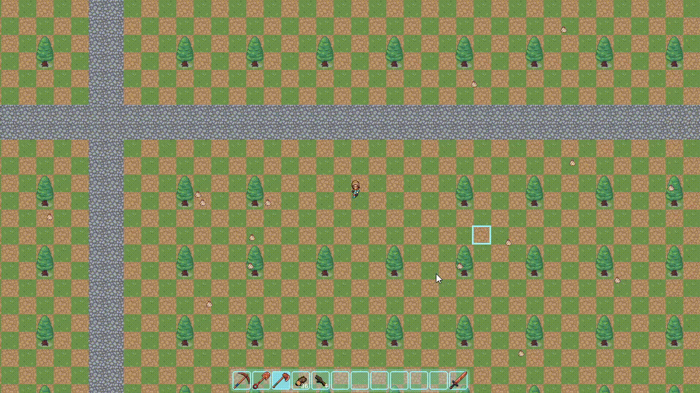

# Projekt Lush Lands

*projekt jest w fazie produkcji*

## Wybrane systemy

- System Eventów - Obsługuje wszelkiego typu zdarzenia mające miejsce zarówno w symulacji gry, jak i na interfejsie użytkownika. 
- System Chunków - Świat gry podzielony jest na kwadratowe obszary o wielkości 32m x 32m, pozwala to na generowanie bardzo dużych światów i (selektywne) symulowanie chunków, konkretniej - tych wokół gracza.
- Gra pozwala na pozyskiwanie i przetwarzanie materiałów. System ekwipunku pozwala na ich przechowywanie, system narzędzi wymaga wybrania odpowiedniego narzędzia do danej pracy. 

W przyszłości:
- Generowanie terenu w oparciu o Perlin Noise - Obszary wygenerowane w ten sposób mają nie tylko naturalny wygląd, ale można je również generować w sposób deterministyczny. Dzięki temu niezależnie gdzie zaczniemy generować mapę, zawsze będzie ona konsystentna. 

## Struktura projektu

### Core
Zawiera typy, enumeratory i funkcjonalności dostępne we wszystkich innych miejscach w projekcie. 

### Controller
Zajmuje się obsługą inputu i eventów. 
System eventów odpowiada za obsługę wszelkich zdarzeń na ekranie gry, które w późniejszym etapie przetwarzane są na faktyczne zmiany.

### Simulation
Zawiera cały model, mechanikę gry. To tutaj definiowane i budowane są typy elementów gry. Obecne tutaj funkcje zawierające zachowanie elementów gry wywoływane są przez eventy z controllera. 

### View
Etap przedstawiania symulacji na ekranie. Poprzednie etapy odpowiadają za symulację i wprawianie gry w ruch, dopiero tutaj jest ona przedstawiana dla gracza. Etap ten zajmuje się zarówno przedstawianiem świata, jak i wyświetlaniem interfejsu. 

